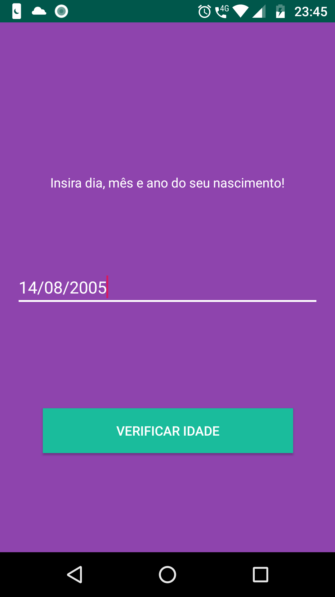

# App Calcula Idade do Usuário

Ao fornecer uma data de nascimento o app responde se você é um adulto ou adolescente.

## Getting Started

### Pre-requisitos

```
Ter o android Stúdio instalado na sua máquina.
```

### Instalação

```
git clone https://github.com/marcossaore/app-exercicio-calcula-idade
cd app-exercicio-calcula-idade
abrir com Android Studio
clicar no ícone de "run"
Só alegria... 😜😜
```

## License

This project is open-source

## Telas

<br/>